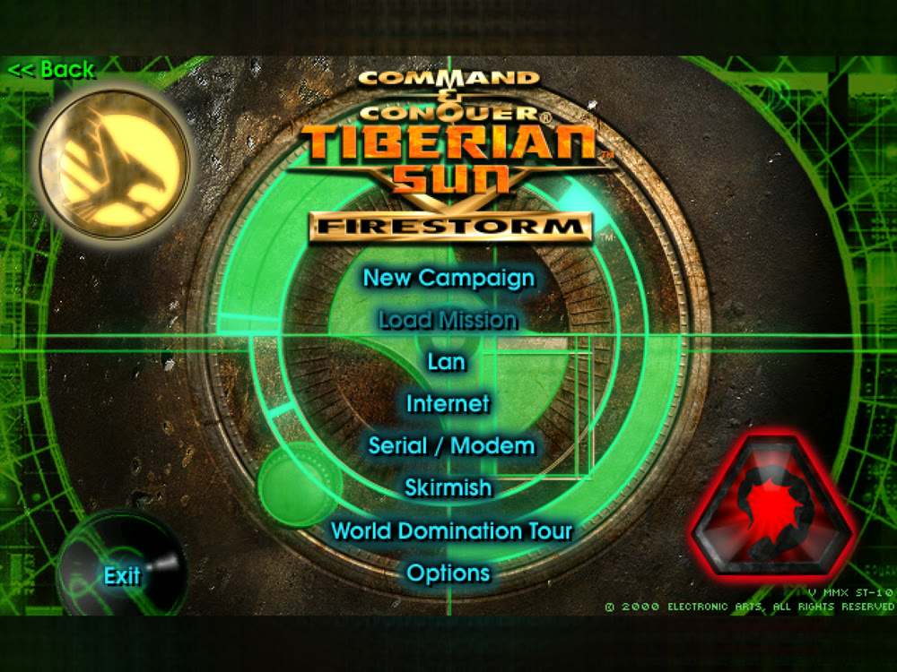
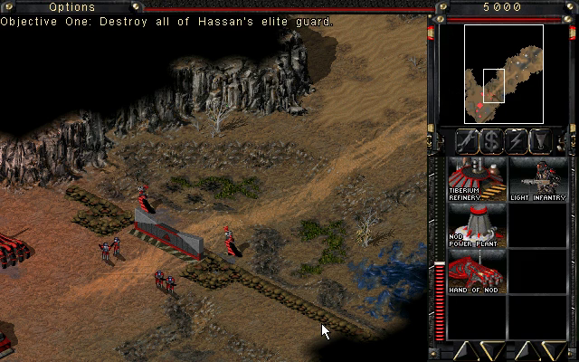
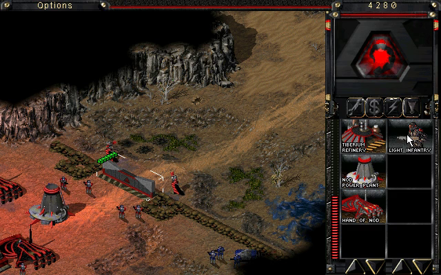
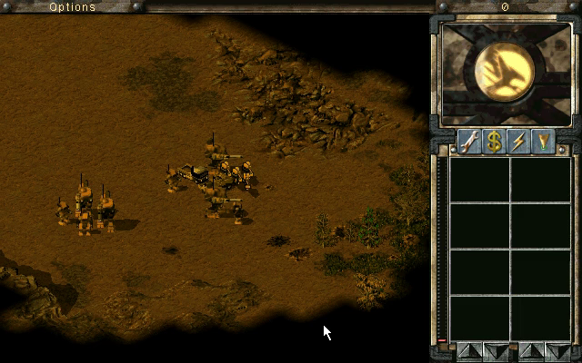
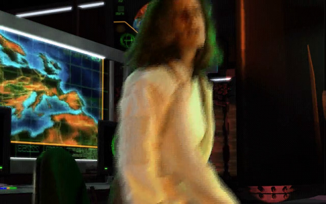

# Tiberian Sun and Firestorm — Static Recompilation

Static recompilation of **Command & Conquer: Tiberian Sun** and its expansion
**Firestorm** (Westwood Studios, 1999–2000) from the shipping Win32 binary,
`Game.exe`, to native C. The goal past running it is the same remaster
[redalert2-recomp](https://github.com/sp00nznet/redalert2-recomp) gives the
next game on this engine: higher resolutions, proper scaling and a modern
presentation layer, built on the game's own code rather than a
reimplementation.

Built on the [pcrecomp](https://github.com/sp00nznet/pcrecomp) toolchain. The
host, the presenter, the scripted input and the test tools come from
redalert2-recomp; everything tied to an address was found again in this exe
([RECON.md](docs/RECON.md)).

## What the remaster adds

Everything here is built around the game's own code, recompiled; `--classic`
gives the original display, and `--original` runs the shipping machine code
for comparison.

- **Its own window.** The game draws into a Direct3D 11 presenter instead of
  taking over the screen: a resizable window or borderless fullscreen (F11),
  sharp at any size.
- **Scaling** (F12): sharp-bilinear (the default), smooth, CRT, nearest, or
  whole multiples only.
- **A settings menu** (F10): scaling, fullscreen, HD vehicles and the game's
  resolution, kept in `build\ts.ini`.
- **High resolution and widescreen**: 1280x720 up to 3840x2160 in game, more
  of the battlefield on screen; above 1080 lines the sidebar needed a fix
  (docs/hires.md).
- **Framed menus**: the 640x400 menus in a widescreen window sit on a blur of
  themselves instead of black bars.
- **HD vehicles**: units, their shadows and voxel debris drawn at twice the
  resolution of the picture, from the game's own voxel models
  (docs/voxels.md).
- **Windows, Linux and macOS**: on Windows the C runtime is linked in, so
  there is no Visual C++ redistributable to install. On Linux the game also
  runs **natively, with no Wine**: the same lifted C on pcrecomp's own
  implementation of the Windows API, with SDL2 for the window and sound
  ([Linux, native](#linux-native)). On macOS (and Linux) the exe is
  cross-built with clang-cl and played under CrossOver or Wine
  ([macOS and Linux, under Wine](#macos-and-linux-under-wine)). `--mute` for
  silent runs.

## Status: **bring-up, playable.** The whole exe lifts with 0 errors; both games' main menus, skirmishes from 640x400 to 3840x2160, all four campaigns to their first mission with their movies, and building a base, checked by a scripted suite.

| Stage | State |
|---|---|
| The build | the Steam release in *The Ultimate Collection*: `Game.exe`, 2000-06-05, no DRM ([RECON.md](docs/RECON.md)) |
| RTTI class recovery | 807 classes, 895 vtables, 5,226 virtual methods |
| Function catalog (`disasm32`) | 18,552 functions, 92.0% of `.text` |
| Lift (`run_lift.py --all`) | 18,559 functions, 3.9M lines of C, **0 lift errors**; 45 patches |
| Host (`build/ts.exe`, 32-bit, pcrecomp `native32`) | the logos, the Tiberian Sun / Firestorm choice, both main menus, skirmishes, the GDI and Nod campaigns of both games with their VQA movies, and building and training in a mission ([bringup.md](docs/bringup.md)) |
| High resolution | 720p, 1080p, 1440p and 4K in game; above 1080 lines the sidebar needed a fix ([hires.md](docs/hires.md)) |
| Playtest suite (`tools/playtest.py`) | **29 cases**: every main-menu entry (LAN, Internet and World Domination Tour as far as they go without servers, Back, Exit) and the Options screens, save and load, skirmish 640x400 to 4K, the four campaigns, a base built and an infantryman trained in a mission and in a skirmish (the MCV deployed), band selection and force-fire, HD vehicles and voxel debris on; all pass, three at a time ([testing.md](docs/testing.md)) |
| Conformance (`tools/conformance.py`) | **8/8** boot milestones to the choice screen, lift 0 errors |
| Native Linux (`build-linux/ts`, pcrecomp `win32hle`) | the same lift as a Linux program, no Wine: boot, menus and dialogs, campaigns, skirmishes to 4K, saves, HD vehicles; the playtest suite in Docker ([Linux, native](#linux-native)) |
| Presenter (the default display) | the game in its own Direct3D 11 window, from redalert2-recomp: sharp scaling, blurred bars, clicks mapped into the game; checked with the menus ([presenter.md](docs/presenter.md)) |
| HD vehicles | units, their shadows and voxel debris at 2x, Red Alert 2's four half-pixel passes found again in this renderer ([voxels.md](docs/voxels.md)) |

Three walls so far, each in [bringup.md](docs/bringup.md): a gadget rect the
game never initialised (a crash on a quarter of runs, from the first mouse
move), a window procedure the catalog missed, and dialog templates in a
read-only resource DLL.

## Screenshots

In the presenter's window (a 2338x1754 window on a high-DPI screen; the
640x400 menu sharp-scaled, the bars a blur of the picture):



Rendered by the recompiled game and recorded headlessly by the playtest
suite: the choice between the two games, Firestorm's main menu, the skirmish
setup and a skirmish; the first Nod mission, with a power plant and a Hand of
Nod built by the suite; Firestorm's first GDI mission and its opening movie.

| | |
|---|---|
|  |  |
|  |  |
|  |  |
|  |  |

## Getting Started

You need **your own copy of Tiberian Sun and Firestorm**: the Steam build
(the folder holding `Game.exe`, `Language.dll` and the `.mix` files).
Nothing from the game is in this repository and nothing is downloaded for
you. The lifted C is generated on your machine from your copy and is never
distributed. On Linux, see [Linux, native](#linux-native); on macOS,
[macOS and Linux, under Wine](#macos-and-linux-under-wine).

### Quick start

1. Download this repository (the green **Code** button, then **Download ZIP**)
   and unzip it somewhere with 6 GB free.
2. Double-click **`Setup.cmd`**.

It checks for Python 3.10+, the `pefile` and `capstone` packages, the pcrecomp
toolkit, Visual Studio 2022 with the C++ x86 tools, CMake and Ninja, and
**asks** before installing anything. It finds the game in your Steam library or
asks for the folder, copies it into `game\`, builds the function catalog,
lifts and builds. A rerun skips finished steps. If it stops, it says why in one
sentence; the details are in `setup.log`. It has been run end to end from a
clean folder.

It ends with `Tiberian Sun (recomp).cmd` in this folder: double-click it to
play. F10 opens the settings.

### Step by step

Prerequisites: Windows 10/11, **Python 3.10+** (`py -3 --version`), **git**,
**Visual Studio 2022** (any edition, or the Build Tools) with *Desktop
development with C++* including the x86 tools, **CMake 3.20+** and **Ninja**,
and the pcrecomp toolkit cloned **beside** this repository as `tools`:

```
some-folder\
  tools\          <- git clone https://github.com/sp00nznet/pcrecomp tools
  tiberiansun\    <- this repository
```

1. Python packages:
   ```
   py -3 -m pip install --user pefile capstone
   ```
2. Copy your install into `game\`:
   ```
   robocopy "<Steam>\steamapps\common\Command & Conquer Tiberian Sun" game /E
   ```
3. Headers, imports and C++ classes (seconds):
   ```
   py -3 ..\tools\tools\pe\pe_analyze.py game\Game.exe --json work\pe_analysis.json
   py -3 ..\tools\tools\cpp\rtti.py game\Game.exe -o work\rtti.json --seeds work\rtti_seeds.json
   ```
   Expected from `rtti.py`: `classes : 807` and `virtual methods : 5,226`.
4. The function catalog (a few minutes):
   ```
   py -3 ..\tools\tools\disasm\disasm32.py game\Game.exe -o work\functions.json --seed-functions work\rtti_seeds.json
   ```
   Expected: about `Functions: 18548` and `(92.0% of code range)`.
5. Lift (a minute or two):
   ```
   py -3 run_lift.py --all
   ```
   Expected: `not-lifted stubs 0   errors 0`.
6. Build (from a plain terminal; `build.cmd` sets up the x86 compiler itself):
   ```
   build.cmd
   ```
7. Play:
   ```
   build\ts.exe --run
   ```

The usual trip-ups: `python` opening the Microsoft Store (that is Windows' alias;
use `py -3`), and a PATH change that needs a new terminal window.

### Linux, native

`build-linux/ts` is a 32-bit Linux program: the same lifted C as the Windows
build, on pcrecomp's `runtime/win32hle`, which answers every Windows call the
game makes itself (files, windows and dialogs, DirectDraw and DirectSound on
SDL2, Winsock, the registry, COM and save-game storage). No Wine and no
Windows DLLs; the game folder is only data.

On Debian or Ubuntu (`setup.sh` names the Fedora and Arch packages):

```
sudo dpkg --add-architecture i386 && sudo apt update
sudo apt install gcc-multilib cmake ninja-build pkg-config python3-pefile python3-capstone \
                 libsdl2-dev:i386 libsdl2-ttf-dev:i386 fonts-liberation
./setup.sh
```

`setup.sh` links `game/` to your install (it looks in your Steam libraries),
catalogs, lifts and builds, and leaves `Tiberian Sun (recomp).sh`. By hand,
it is *Step by step* with `python3` for `py -3` and `./build-linux.sh` for
`build.cmd`, then `build-linux/ts --run`. It needs a current pcrecomp
(`main`); `setup.sh` offers to update an older clone.

The window scales like the Windows presenter: F12 cycles sharp, smooth, CRT,
nearest and integer scaling, F11 (or Alt+Enter) is fullscreen, and
`build-linux/ts.ini` remembers them (`--scale` on the command line).
`--headless`, `--record`, `--mute`, `--hd-voxels`, `--seed` and the scripted
input are the Windows host's; `tools/playtest.py` runs `build-linux/ts` when
it is there. LAN games speak IPXEmu's protocol (IPX over UDP), the one the
Windows build uses through the game folder's `wsock32.dll`: two native
instances find each other and play a match in lockstep (`--args
tools/lan/host.args` and `joiner.args`, with different player names); a
Windows player on the same LAN is not tried yet. Saves are the same compound
files the Windows build writes.

On Debian 13, headless in Docker, the playtest suite passes 29 of 29 (see the
CHANGELOG for the run); it also runs in a window on an Xfce desktop with
PulseAudio. Not on this host: `--original` (it runs the shipping machine code
on Windows) and the F10 settings menu.

### macOS and Linux, under Wine

The same `ts.exe`, cross-compiled with clang-cl and played under Wine:
CrossOver on a Mac, `wine` on Linux. No Visual Studio and no copy of the
game: `game/` is a link to your install. On a Mac, install the game in a
CrossOver bottle; on Linux, from Steam (which runs it with Proton) or have the
folder anywhere. Then:

```
./setup.sh
```

On a Mac it checks for and offers to install Homebrew's `llvm`, `lld`,
`cmake`, `ninja`, `xwin` and `uv`. On Linux it lists what your package manager
should install (clang-cl, lld, llvm, cmake, ninja, wine and Python 3) and
offers to download `xwin`'s release binary. Either way it asks before xwin
downloads the x86 MSVC C runtime and Windows SDK from Microsoft (about 1 GB,
under Microsoft's licence, into `~/.xwin`); finds `pefile` and `capstone` or
puts them in a `.venv`; clones pcrecomp beside this folder as `pcrecomp` (or
uses `../tools`, or `PCRECOMP`); finds the game in your CrossOver bottles or
Steam libraries; and then catalogs, lifts and builds as `Setup.cmd` does. It
leaves a `Tiberian Sun (recomp)` launcher here (`.command` on a Mac, `.sh`
on Linux).

By hand, the steps are *Step by step*'s with `python3` (or `.venv/bin/python`)
for `py -3` and `./build.sh` for `build.cmd`; `./play.sh` runs the build under
Wine, with any host flags after it (on a Mac, `CX_BOTTLE` picks the bottle,
default `Steam`). `tools/playtest.py` and `tools/conformance.py` run the host
through Wine off Windows (`TS_WINE` for another launcher).

It needs a current pcrecomp (`main`), whose native32 supports Wine, and the game
folder's IPXEmu `wsock32.dll` for the LAN screen, which `play.sh` and the
playtests tell Wine to load (`WINEDLLOVERRIDES=wsock32=n,b`). Under Wine 10.0
on Debian 13 (x86-64) the playtest suite passes all 29 cases. Not yet under Wine:
recordings (`--record` starts `ffmpeg` through Wine's `cmd`, which cannot run
a Linux or Mac program; the frame checksums the tests count still come out),
and `--original` is untested. Not yet tried on a Mac.

The Mac and Linux build is ported from the one
[@cpressland](https://github.com/cpressland) wrote for Red Alert 2
([CONTRIBUTORS.md](CONTRIBUTORS.md)).

## Usage

```
build\ts.exe                                  # dry run: map and bind, print the entry point
build\ts.exe --run                            # play, in the presenter's window
build\ts.exe --headless --run --watchdog 60   # no window, stop after 60 s
build\ts.exe --headless --run --record out.mp4
py -3 tools\conformance.py                    # boot milestones + lift health vs the baseline
py -3 tools\playtest.py --jobs 3              # the suite (docs\testing.md)
py -3 tools\playtest.py skirmish-start --original   # the same script on the shipping code
```

Scripted input (headless): `--click x,y@s` and `--move` in game pixels,
`--press DLG:CTRL@s` for the dialog screens, `--waitlog TEXT@s` on the game's
own debug log (`--debuglog` prints it), `--key`, `--drag`, `--select DLG:CTRL=N@s` (a list, a combo box or a
slider). `--seed N` fixes the game's random seed, so a skirmish starts the
same every run. The script's clock
starts at the game's `Game Init Completed`.

Environment: `TS_EXE` (another build to test), `TS_WINE` (the Wine launcher
off Windows), `TS_HOST_ARGS` (extra host
flags for every playtest case), `TS_PROBE_ALL=1` (`--probe` reports every
call, not the first five), `TS_DDTRACE=1` (the first DirectDraw locks and
blits), `TS_PROFILE=1` (which lifted functions the time goes to, printed
when the watchdog ends the run).

### Mods

A mod is a folder of the game's own kind of files (rules, art, string tables,
MIX files, maps) in `mods/<name>/`: see [mods/README.md](mods/README.md). The game's
folder is never changed. The mod's folder is laid over it, so the game reads
the mod's file where it has one and its own where it does not, and what it
writes while a mod is on (settings, saves) goes into the mod's folder.
`--mod NAME` plays one (`--mod none`, none); on Windows the settings menu
(F10) lists them, on Linux F9 Tried: a rules and art mod (Mistweaver's). steps through them, and either restarts the
game with the one chosen and remembers it. Mods built on DLLs that patch
`Game.exe`'s machine code (Ares, Phobos and the like) cannot work on a recompiled
game. in the menus

### Reading the lifted C

The lift (`src/recomp/gen`, made on your machine, never committed) names what
the binary itself names (pcrecomp's `tools/lift/name_lift.py`): virtual
methods by their class and vtable slot from RTTI (`UnitClass__virtual_42`,
COM's by name: `OverlayClass__Load`), constructors, destructors and
`operator_delete` by their shape, and functions that print their own name in
a debug message by it. Each function has a header saying how it was named,
its `this` class, the strings it uses, the Windows calls it makes and how many
places call it, and a constant that is a string's or a vtable's address has a
comment. A function with no such evidence keeps its address name
(`sub_` and its address) and still gets the header. The address is in each header and
in its `RECOMP_ENTER`, so a crash report's address finds the function.

## Building from source

Steps 5 and 6 above. `PCRECOMP` (environment, for `run_lift.py`) and
`-DPCRECOMP=` (CMake, through `CMAKE_ARGS` for `build.cmd`) point at a toolkit
checkout other than `..\tools`; the lifter and the runtime must come from
the same tree. It builds from pcrecomp `main`, with MSVC or clang-cl (x86:
`set CMAKE_ARGS=-DCMAKE_C_COMPILER=clang-cl -DCMAKE_C_FLAGS=-m32` and
another `BUILD_DIR`; the suite passes on both).

Contributions: [CONTRIBUTING.md](CONTRIBUTING.md).

## Contributors

See **[CONTRIBUTORS.md](CONTRIBUTORS.md)** for who did what. Thank you, all of
you.

## License

The code here is MIT ([LICENSE](LICENSE)). *Command & Conquer: Tiberian Sun*
and *Firestorm* are © Westwood Studios / Electronic Arts; no game files are
included or distributed.
