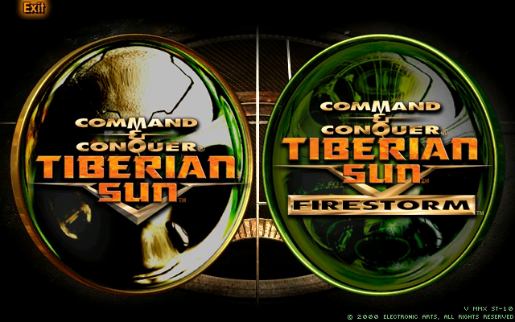
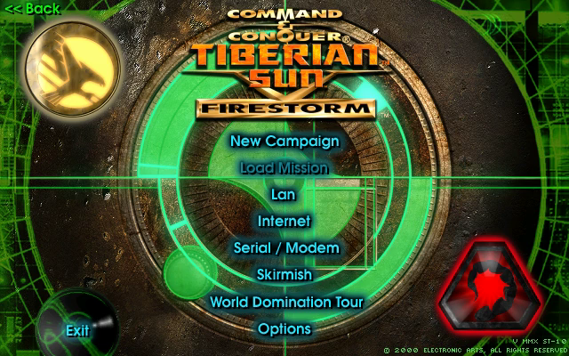
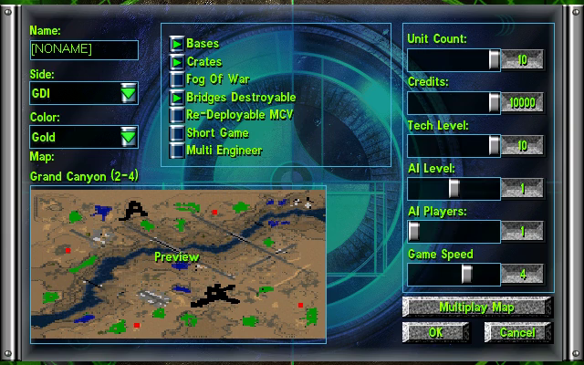
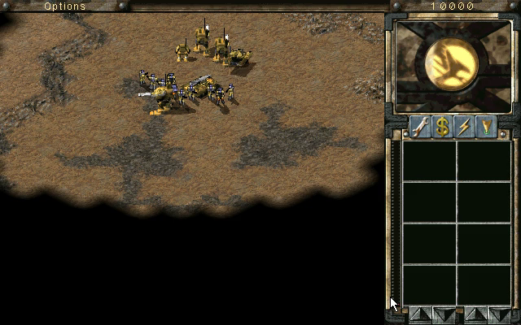

# Tiberian Sun and Firestorm — Static Recompilation

Static recompilation of **Command & Conquer: Tiberian Sun** and its expansion
**Firestorm** (Westwood Studios, 1999–2000) from the shipping Win32 binary,
`Game.exe`, to native C. The goal past running it is the same remaster
[redalert2-recomp](https://github.com/sp00nznet/redalert2-recomp) gives the
next game on this engine: higher resolutions, proper scaling and a modern
presentation layer, built on the game's own code rather than a
reimplementation.

Built on the [pcrecomp](https://github.com/sp00nznet/pcrecomp) toolchain. The
host, the presenter, the scripted input and the test tools come from
redalert2-recomp; everything tied to an address was found again in this exe
([RECON.md](docs/RECON.md)).

## Status: **bring-up, in game.** The whole exe lifts with 0 errors; both games' main menus, the skirmish setup screen and a skirmish run, from 640x400 to 3840x2160, checked by a scripted suite.

| Stage | State |
|---|---|
| The build | the Steam release in *The Ultimate Collection*: `Game.exe`, 2000-06-05, no DRM ([RECON.md](docs/RECON.md)) |
| RTTI class recovery | 807 classes, 895 vtables, 5,226 virtual methods |
| Function catalog (`disasm32`) | 18,552 functions, 92.0% of `.text` |
| Lift (`run_lift.py --all`) | 18,559 functions, 3.9M lines of C, **0 lift errors**; 35 patches |
| Host (`build/ts.exe`, 32-bit, pcrecomp `native32`) | the logos, the Tiberian Sun / Firestorm choice, both main menus, the skirmish setup, a skirmish in game ([bringup.md](docs/bringup.md)) |
| High resolution | 720p, 1080p, 1440p and 4K in game; above 1080 lines the sidebar needed a fix ([hires.md](docs/hires.md)) |
| Playtest suite (`tools/playtest.py`) | **9 of 9 passing** ([testing.md](docs/testing.md)) |
| Conformance (`tools/conformance.py`) | **8/8** boot milestones to the choice screen, lift 0 errors |
| Presenter | carried over from redalert2-recomp (scaling, F10 settings, the game's resolution); not yet checked against Tiberian Sun in a window |
| HD voxels | not yet: redalert2-recomp's patches have to be found again in this renderer |

Three walls so far, each in [bringup.md](docs/bringup.md): a gadget rect the
game never initialised (a crash on a quarter of runs, from the first mouse
move), a window procedure the catalog missed, and dialog templates in a
read-only resource DLL.

## Screenshots

Rendered by the recompiled game and recorded headlessly by the playtest
suite: the choice between the two games, Firestorm's main menu, the skirmish
setup and a skirmish.

| | |
|---|---|
|  |  |
|  |  |

## Building

You need **your own copy of Tiberian Sun and Firestorm**: the Steam build
(the folder holding `Game.exe`, `Language.dll` and the `.mix` files).
Nothing from the game is in this repository and nothing is downloaded for
you. The lifted C is generated on your machine from your copy and is never
distributed.

`Setup.cmd` is adapted from redalert2-recomp's but has not been run end to
end for this game yet; the steps below are the tested route.

Prerequisites: Windows 10/11, **Python 3.10+** with `pefile` and `capstone`,
**Visual Studio 2022** with the C++ x86 tools, **CMake 3.20+**, **Ninja**,
and the pcrecomp toolkit beside this repository as `tools` (or anywhere, with
`PCRECOMP` pointing at it):

```
robocopy "<Steam>\steamapps\common\Command & Conquer Tiberian Sun" game /E
py -3 ..\tools\tools\pe\pe_analyze.py game\Game.exe --json work\pe_analysis.json
py -3 ..\tools\tools\cpp\rtti.py game\Game.exe -o work\rtti.json --seeds work\rtti_seeds.json
py -3 ..\tools\tools\disasm\disasm32.py game\Game.exe -o work\functions.json --seed-functions work\rtti_seeds.json
py -3 run_lift.py --all          # lifted 18559   not-lifted stubs 0   errors 0
build.cmd
build\ts.exe --run
```

## Usage

```
build\ts.exe                                  # dry run: map and bind, print the entry point
build\ts.exe --run                            # play, in the presenter's window
build\ts.exe --headless --run --watchdog 60   # no window, stop after 60 s
build\ts.exe --headless --run --record out.mp4
py -3 tools\conformance.py                    # boot milestones + lift health vs the baseline
py -3 tools\playtest.py --jobs 3              # the suite (docs\testing.md)
py -3 tools\playtest.py skirmish-start --original   # the same script on the shipping code
```

Scripted input (headless): `--click x,y@s` and `--move` in game pixels,
`--press DLG:CTRL@s` for the dialog screens, `--waitlog TEXT@s` on the game's
own debug log (`--debuglog` prints it), `--key`, `--drag`. The script's clock
starts at the game's `Game Init Completed`.

Environment: `TS_EXE` (another build to test), `TS_HOST_ARGS` (extra host
flags for every playtest case), `TS_PROBE_ALL=1` (`--probe` reports every
call, not the first five), `TS_DDTRACE=1` (the first DirectDraw locks and
blits).

## License

The code here is MIT ([LICENSE](LICENSE)). *Command & Conquer: Tiberian Sun*
and *Firestorm* are © Westwood Studios / Electronic Arts; no game files are
included or distributed.
