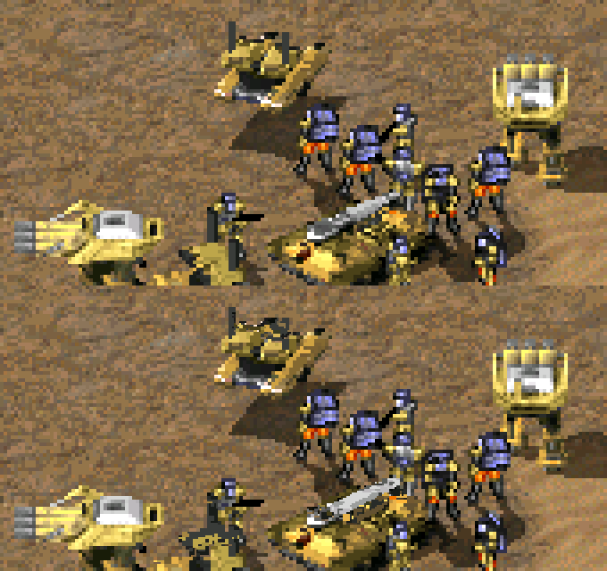

# The voxel renderer and HD voxels

Vehicles, mechs and aircraft are voxels (`.VXL` models with `.HVA`
animation). This is how Tiberian Sun draws them, found by the shapes
redalert2-recomp's docs/voxels.md describes (Red Alert 2's renderer grew out
of this one), and how HD voxels draw them at twice the resolution.

## The path of one unit

```
UnitClass Draw_It            0x00652330  points [0x0074C5E4] at the staging surface [0x0080FA54]
  FootClass                  0x004A5B50
  TechnoClass Draw_Voxel     0x006354E0  voxel cache: key -1 means none
    render the body          0x00635B00
      view setup and clear   0x00666030  clears the last bounding box of both buffers
      sections               0x00666300
      finish                 0x00666720  records -> pixels; fills a 6-dword rect at ecx
        list at 0x00832740   0x00668A00  (count 0x00822338, 0x3C bytes each)
        list at 0x00820120   0x00668730  depth-sorted (count 0x0081FFE8, 0x88 bytes each)
          rasterizer         [0x00713878 + mode*4]  32 entries, C and hand-written assembly
      blit into staging      0x0047CC10  with the remap
  copy staging out           0x00651F50 (vtable +0x3C8) -> 0x00423530, three call sites
shadow                       0x00635E20  its own render and blit
other voxel bodies           0x004472C0
```

| What | Where | |
|---|---|---|
| Colour | `0x00822740`, 256x256, 1 byte | palette indices; pixel = `y * 256 + x` |
| Depth | `0x0080FDA8`, 256x256 | cleared with the colour when the Z flag (`0x00835648`) is set |
| Bounding box | `0x00822328` | x, y, w, h (inclusive), then the list count |
| Surface | `BSurface` at `0x008200F0` | wraps the colour buffer (`0x00665EA0` returns it) |
| Palette | `0x00822340` | `voxels.vpl`, loaded by `0x004DFB70` |
| Staging | `[0x0080FA54]`, 160x160, 1 byte | a unit's parts; dirty rect at `0x0080F8E0` |

The span record handed to the rasterizer (`esp+0x20` in `0x00668730`) has
its starts in 8.8 fixed point at `+0x18` (x) and `+0x1A` (y), and the mode is
built the same way as Red Alert 2's: a base from a table, `| 2` with the
Z-buffer, `| 4` from `0x0083564C`, `| 8` when the section's byte `+0xA3` is
zero. The structures match Red Alert 2's field for field; the addresses and
the staging surface's size (160x160 here, 256x256 there) are what differ.

## HD voxels

With HD voxels on (the presenter's settings menu, F10; `--hd-voxels`),
vehicles are drawn at twice the resolution of the rest of the picture. The
game is untouched: everything it draws, reads and caches is what it would
have been, and the 2x pixels exist only in the presenter's frame.



*Top, the frame at 1x; bottom, the same frame with HD voxels (both zoomed):
the Mammoth Mk. II, the MCV and a hover tank. Infantry are sprites and stay
as they are.*

It is Red Alert 2's method (src/runtime/hdvox.c, run_lift.py
`HD_VOXEL_PATCHES`):

- the finish stage (`0x00666720`) runs three more times, with every span
  starting half a pixel further left, up, or both (the record's starts,
  patched at `0x006689E2`); the four images interleave into one at 2x, and
  are remembered by a hash of their 1x pixels;
- each part's blit into staging (`0x0047CC10` at `0x00635DEB`) is watched:
  the remap it applied is learnt from what it wrote, and the part's 2x image
  is kept remapped;
- the copy of staging onto the battlefield (`0x00423530`, from `0x00651F50`)
  is watched the same way: each index's final colour, and which pixels the
  unit really got (the Z-buffer's say), from the battlefield before and after;
- the copy into the primary (`0x0048B590`) ends a frame, and the records are
  published; the presenter shows a record's four 2x pixels wherever the
  finished frame still shows exactly what the unit wrote there.

While HD voxels are on, the voxel cache is off (`0x006354EC` gives
`0x006354E0` the key -1), so every unit is rendered each frame; the three
extra passes run only for an image not seen before, so nearly all come from
memory.

**Shadows** are a separate render (`0x00635E20`, from the shadow draw
`0x00635860`, whose cache is off the same way), plotted by `0x00668A00` from
an 8.8 start at `[esp+0x30]`/`[esp+0x32]` (patched at `0x00668A94`), and
blitted onto the battlefield by `0x0047CC10` with the shadow converter. The
2x shadow is Red Alert 2's: the four passes' union with its holes closed,
darkened the way the 1x one is. Most of a shadow is under its unit; what
shows at 2x is its edge.

Not yet: the other voxel bodies through `0x004472C0` have their passes but
their records are not checked; voxel animations and debris.
